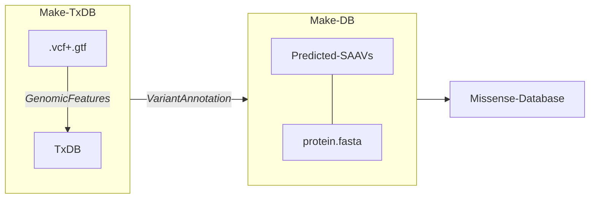

# Chemoproteogenomics 
### Table of Contents: 

- [Generating sample-specifc variant containing FASTA databases](https://github.com/hdesai17/chemoproteogenomics#custom-database-generation)
   - +/- all combinations of variants
- [MSFragger command line pipelines for 2-stage searches](https://github.com/hdesai17/chemoproteogenomics#msfragger-command-line-2-stage-search)

The [FragPipe GUI](https://github.com/Nesvilab/FragPipe) is now compatible with 2-stage searches. \
Instructions on running are located in bioXiv manuscript: [Multi-omic stratification of the missense variant cysteinome](https://doi.org/10.1101/2023.08.12.553095) in supplementary information.

>[!IMPORTANT]
>:exclamation:
>_The updated GUI is recommended over command-line scripts provided here._ 

## Custom Database Generation

Generate sample-matched peptide variant-containing databases from VCFs with option to generate all combinations of variants. Outputs full protein sequence and trpytic peptide databases with detailed FASTA headers or minimal headers that can be used in searching mass-spectromtery based proteomics data.

VCF processing:

#### Before Running
 1. Download or clone the repo

`git clone https://github.com/hdesai17/chemoproteogenomics.git`
   
 2. Move VCF file into the root directory (_../chemoproteogenomics_) or make sure the working directory contains VCF, Annotations/Tools folders and GenerateBD.sh script \
   A sample VCF file is [here](https://drive.google.com/drive/folders/1w1EaQC7q5uVudEMCGo-zREVJhK-YOC13?usp=sharing)

>[!IMPORTANT]
>The VCF has should have file name format SAMPLE_NAME_RNA.vcf or SAMPLE_NAME_Exome.vcf

`mv *.vcf chemoproteogenomics`
    
 3. Download Genocode v28 protein coding translations and GTF annotation files as well as RData file of common missense SNPs [from this link](https://drive.google.com/drive/folders/1w1EaQC7q5uVudEMCGo-zREVJhK-YOC13?usp=sharing) and move all three into Annotations directory 
    
`mv *gencode /path/to/working/directory/Annotations/` \
`mv *common /path/to/working/directory/Annotations/`

>[!IMPORTANT]
>Several requirements necessary to run
>- R packages _VariantAnnotation, BSgenome.Hsapiens.UCSC.hg38, svMisc, pbapply_ and any other dependencies
>- Python v3.0+

#### Running

`./GenerateDB.sh [sample name] [TRUE/FALSE]` or `sh GenerateDB.sh [sample name] [TRUE/FALSE]`

The arguments are sample name (no spaces) followed by TRUE or FALSE if generating all combination of variants (Default = FALSE)

>[!WARNING]
>Combinations of variants require R packages for parallel computing to minimize time: \
>_doParallel_, _foreach_, _doSNOW_ \
>Uses all cores - 2 \
>Recommended use without combos

#### Outputs

In the Custom_Databases folder, there are variations of FASTA databases:
- _2TS = two tryptic sites flanking variant sites, otherwise, they are whole protein sequences_
- _rev = contains reverse sequences specified as REV_
- _dedup = redundant peptide sequences are removed, regardless of transcript ID_
- _simple = only Uniprot ID (minimal) headers_

Example header with annotations: 
>sp|P01116-1|ENSG00000133703.11|KRAS|ENST00000256078.8|122572-H358_RARE_RNA-G12C|12c|

sp|Uniprot-ID|Ensembl Gene ID|Gene Name|Ensembl Transcript ID|Internal-TxID_Sample_Rare/Common-NGS-Source|AA Mutation|

The internal TxID is used in _makeDB.R_ to match missense mutations to proteins

>[!NOTE]
>In FragPipe search outputs, the 'Protein' column will contain the fasta header information; though, it is recommended to re-map peptides to reference databases for any possible tryptic peptides that fall outisde of the variant region (these will be limited in the case of 2-stage searches).

>[!WARNING]
>For minimal (simple) FASTA headers, additional post-processing is required to obtain variant IDs after FragPipe searches.

#### Running

`./GenerateDB.sh [sample name] TRUE` or `sh GenerateDB.sh [sample name] TRUE`

## MSFragger command-line 2-stage search
>[!NOTE]
>_The updated GUI is recommended over command-line scripts._ 

Process .raw MS files with an MSFragger pipeline using Philospher and Peptide Prophet for post-processing with optional IonQuant quantitation. 

#### Before Running

1. Download or clone the repo

  `git clone https://github.com/hdesai17/chemoproteogenomics.git`

2. 2-stage_cmd-line folder contains run script and helper scripts.
  
>[!IMPORTANT]
>Several files require path updates (see notes 'pipeline' and 'run' scripts)

#### Running
   
`./2-stage-run.sh` or `sh 2-stage-run.sh`
 

